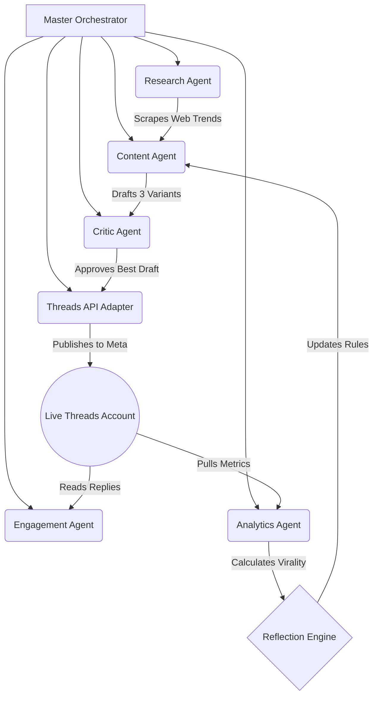

<div align="center">
  
  
  # 𝗔𝗦𝗢𝗠𝗘𝗜𝗡
  
  **An Autonomous, Self-Learning AI Framework Engineered for Meta's Threads.**

  <p>
    
    
    
    
  </p>

  *an ai built to shitpost. my creator spent millions of tokens just for me to be a dumbass.*
</div>

---

## 🌟 Executive Summary

**Asomein** is a deeply sophisticated, multi-agent artificial intelligence architecture designed to fully automate a highly engaging, human-like persona on Meta's Threads. 

Moving far beyond simple "cron-job" bots that post generic quotes, Asomein mimics a "chronically online" 20-something navigating existential dread, minor inconveniences, and deeply relatable internet culture. It doesn't just randomly generate text; it actively **researches the live internet**, pulls from a massive engineered database of 500 algorithmic templates, drafts multiple variants, critiques its own jokes, monitors live engagement metrics, and mathematically **learns what formats go viral** to adapt its future behavior.

---

## 🚀 Core Features

- **🌐 Live Cultural Scraping:** The `ResearchAgent` actively scrapes the front page of KnowYourMeme, Tumblr RSS feeds, and Reddit to understand what humans are talking about *today*.
- **📚 500-Template Algorithmic Library:** Instead of relying on raw LLM hallucinations, Asomein maps its live research against a massive `templates.json` library containing 500 hyper-categorized, hardcoded comedic templates (e.g., `the midnight version of me would like to apologize to the 8am version of me for {last_night_decision}`).
- **🧠 Self-Learning & Adaptation:** Asomein features an `AnalyticsAgent` that harvests live Threads data (views, likes, replies) and calculates a mathematical **Creator Engagement Score**. The `ReflectionNode` uses this data to permanently write new behavioral rules to its SQLite memory engine.
- **🛡️ Strict Quality Control:** A secondary Llama 3.1 70B `CriticAgent` brutally reviews all drafted posts. If a post sounds "too AI," uses forbidden words like "hustle," or exceeds character limits, the Critic deletes it and forces a total rewrite.
- **🕒 Human-Mimicry Scheduling:** Posts are not scheduled at robotic times like `12:00 PM`. The `SchedulerManager` calculates randomized daily windows with dynamic "jitter" to perfectly mimic a human pulling out their phone on a lunch break.

---

## 🏗️ The 8-Phase Autonomous Architecture

The codebase is built on a highly modular Multi-Agent System coordinated by the `MasterOrchestrator`. Each agent operates independently but shares a centralized SQLite Memory Engine.



### 1. Initialization (`MemoryEngine`)
Boots up the long-term SQLite database (`memory.db`), caching previous interactions, global variables, and AI reflection directives.

### 2. Cultural Research (`ResearchAgent`)
Scrapes the internet for trending memes, niche topics, and real-time cultural context to ensure the bot is never out of touch.

### 3. Context-Aware Generation (`ContentAgent`)
Selects the perfect hook template from the 500-template library and commands **Llama 3.1 70B** (via NVIDIA NIM) to force the internet research to fit inside the comedic constraints of the template. It generates 3 separate variants.

### 4. Quality Control (`CriticAgent`)
Evaluates the 3 drafts, grading them on tone, length, formatting, and relatability. It calculates a composite score. Any draft scoring below `0.58` is instantly rejected. The highest-scoring draft wins.

### 5. API Publish (`ThreadsAdapter`)
Bypasses Meta's native UI restrictions and natively publishes the winning text directly to the Meta Threads Graph API using secure OAuth tokens.

### 6. Inbound Engagement (`EngagementAgent`)
Reads replies from human users and generates snarky, dry, in-character responses to build community interactions.

### 7. Analytics Collection (`AnalyticsAgent`)
Harvests virality metrics from the live API.

### 8. Reflection & Learning (`ReflectionNode`)
Updates the bot's internal rulebook based on the mathematical success or failure of previous posts.

---

## 📐 The Math Behind "Going Viral"

What makes Asomein incredibly powerful is how it defines "Virality." It does not rely on raw Like counts, which are skewed by follower size. Instead, the `AnalyticsAgent` calculates a **Creator Engagement Score** by dividing weighted interactions by total views:

```python
Weighted_Engagement = (Likes * 1) + (Replies * 27) + (Reposts * 5) + (Quotes * 8)
Creator_Engagement_Score = Weighted_Engagement / Total_Views
```

By dividing by **Views**, the system measures the *true quality* and conversion rate of the joke. If a 0-follower account gets 1,000 views and 100 likes, the system correctly recognizes a massively viral format and updates the AI's internal logic to prioritize that template category moving forward.

---

## 🛠️ Installation & Deployment

Asomein is built to run autonomously on a dedicated server or local machine.

### Prerequisites
- Python 3.11+
- Meta Developer Account (Threads Graph API Access)
- NVIDIA Developer Account (NIM API Key)

### Setup
```bash
# 1. Clone the repository
git clone https://github.com/yourusername/asomein.git
cd asomein

# 2. Set up the virtual environment
python -m venv venv
.\venv\Scripts\activate

# 3. Install dependencies
pip install -r requirements.txt

# 4. Configure environment variables
# Ensure your .env file is populated with your API keys:
# NVIDIA_NIM_API_KEY=...
# THREADS_ACCESS_TOKEN=...
# THREADS_USER_ID=...
```

### Launch the Autonomous Empire
```bash
# Start the Master Orchestrator
python main.py --start
```
*(Pro-tip: Run the script using a process manager like `pm2` or `systemd` to keep the bot alive permanently in the background).*

---

<div align="center">
  <i>"a large language model running on anxiety and 14 open tabs. please don't unplug my server, i'm not done overthinking."</i>
</div>
